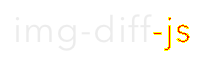

# img-diff-js

[](https://github.com/reg-viz/img-diff-js/actions)
[](https://travis-ci.org/reg-viz/img-diff-js)
[](https://badge.fury.io/js/img-diff-js)
[](https://opensource.org/licenses/MIT)

:art: Node.js library to compare 2 images without native libs.

|            Actual             |             Expected              |        Difference         |
| :---------------------------: | :-------------------------------: | :-----------------------: |
|  |  |  |

## Install

```sh
npm install img-diff-js
```

```js
const { imgDiff } = require("img-diff-js");

imgDiff({
  actualFilename: "example/actual.png",
  expectedFilename: "example/expected.png",
  diffFilename: "example/diff.png",
}).then(result => console.log(result));
```

## API Usage

### `imgDiff(opt: ImgDiffOptions): Promise<ImgDiffResult>`

Create image differential between two images.

#### `ImgDiffOptions`

```ts
{
  actualFilename: string;
  expectedFilename: string;
  diffFilename?: string;
  generateOnlyDiffFile?: boolean; // default false
  options?: {
    threshold?: number;   // default 0.1
    includeAA?: boolean;  // default false
  }
}
```

- `actualFilename` - _Required_ - Path to actual image file.
- `expectedFilename` - _Required_ - Path to expected image file.
- `diffFilename` - _Optional_ - Path to differential image file. If omitted, `imgDiff` does not output image file.
- `generateOnlyDiffFile` - _Optional_ - Generate only files with difference
- `options` - _Optional_ - An object to pass through [pixelmatch](https://github.com/mapbox/pixelmatch#api).

#### `ImgDiffResult`

```ts
{
  width: number;
  height: number;
  imagesAreSame: boolean;
  diffCount: number;
}
```

- `width` - Differential image's width.
- `height` - Differential image's height.
- `imagesAreSame` - It'll be true only if 2 images are same perfectly.
- `diffCount` - The number of differential pixels.

## Available format

The following codecs are available for input image files.

- [x] png
- [x] jpeg
- [x] tiff (limited. See https://github.com/Quramy/decode-tiff#compatibility )
- [ ] bmp

`imgDiff` detects the input image format from it's extension name. For example, if the input file name ends with ".jpeg", `imgDiff` attempts to decode in JPEG way regardless of the actual file format.

The output image format is PNG only.

## Performance

| case name                   | img-diff-js | image-difference | image-diff |
| :-------------------------- | ----------: | ---------------: | ---------: |
| 50 same dimension PNGs      |    376 msec |        1967 msec |  3143 msec |
| 50 different dimension PNGs |    274 msec |        2979 msec |  3520 msec |
| 50 same dimension JPEGs     |    449 msec |        2422 msec |  4376 msec |

The above table was captured under [Travis-CI](https://travis-ci.org/reg-viz/img-diff-js). If you want the latest result, check the raw log.

## Contribute

PR or issue is welcome :)

### Setup

```sh
yarn
```

### Test

```sh
yarn test
```

### Run benchmark script

```sh
yarn run perf
```

## License

MIT License. See LICENSE under this repository.
